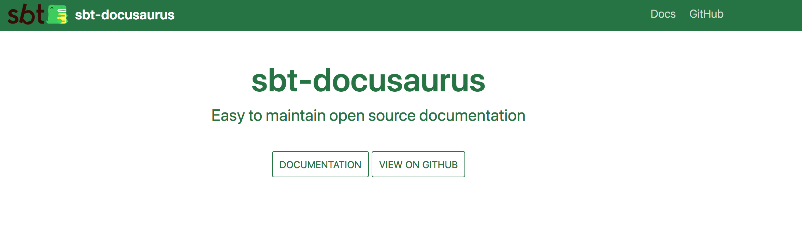
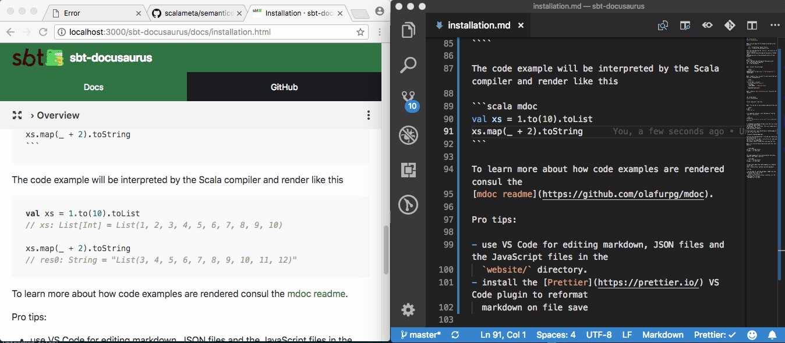

Make sure you have the following installed on your machine

- `sbt`: to build your Scala library
- `yarn`: to build the Docusaurus site

Start by copy-pasting the `website/` directory in the
[sbt-docusaurus](https://github.com/olafurpg/sbt-docusaurus) GitHub repo.
Assuming you are in the working directory of your project

```sh
git clone https://github.com/olafurpg/sbt-docusaurus.git
cp -r sbt-docusaurus/website .
rm -rf sbt-docusaurus
```

Next, install the sbt plugin

```scala
// plugins.sbt
addSbtPlugin("com.geirsson" % "sbt-docusaurus" % "@VERSION@")
```

Next, create a `docs` project in your build that will host your documentation

```scala
// build.sbt
lazy val docs = project
  .in(file("myproject-docs"))
  .settings(
    moduleName := "myproject-docs"
  )
  .dependsOn(myproject)
  .enablePlugins(DocusaurusPlugin)
```

Next, create a `docs/installation.md` file with the contents

```
---
id: installation
title: Installation
---

Install myproject like this: ...
```

Next, fire up sbt in one terminal and build the site

```scala
$ sbt
> docs/run -w
```

In a separate terminal, start docusaurus from the `website/` directory

```sh
cd website
# start the docusaurus server with live reload enabled
yarn start
```

I recommend using Google Chrome since the live reload re-uses the same browser
tab between runs. In Firefox, the live reload starts a new browser tab every
time the browser restarts.

If all went well, you should have a landing page in front of you like this



Click on the "Documentation" link and you should see the installation
instructions. Try to edit `installation.md` and save the file. If all goes well,
the browser should reload after you save the file.



Next, try to write Scala code blocks with the `mdoc` modifier

````
```scala mdoc
val xs = 1.to(10).toList
xs.map(_ + 2).toString
```
````

The code example will be interpreted by the Scala compiler and render like this

```scala mdoc:fail
val number: Int = "Type error!"
```

```scala mdoc
val xs = 1.to(10).toList
xs.map(_ + 2).toString
```

```scala mdoc:fail
val string: String = 42
```

To learn more about how code examples are rendered consult the
[mdoc readme](https://github.com/olafurpg/mdoc).

Pro tips:

- use VS Code for editing markdown, JSON files and the JavaScript files in the
  `website/` directory.
- install the [Prettier](https://prettier.io/) VS Code plugin to reformat
  markdown on file save
