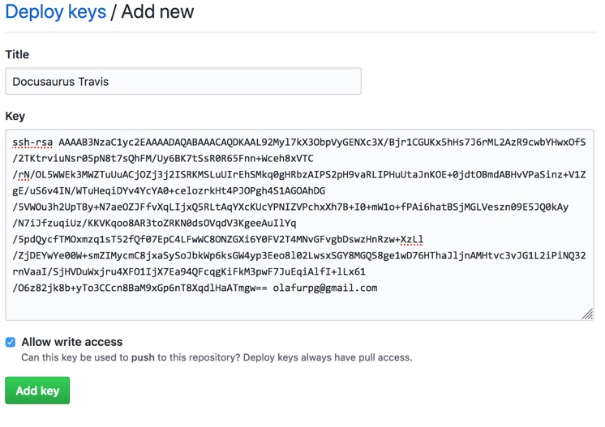

Make sure you have the following installed on your machine

- `sbt`: to build your Scala library
- `yarn`: to build the Docusaurus site

Additionally, we assume the current working directory is the repository of an
existing project that you want to document.

## Docusaurus

Start by copy-pasting the `website/` directory from the
[sbt-docusaurus](https://github.com/olafurpg/sbt-docusaurus) GitHub repo to your
project. This directory contains html/js/css boilerplate for a basic Docusaurus
site

```sh
git clone https://github.com/olafurpg/sbt-docusaurus.git
cp -r sbt-docusaurus/website .
rm -rf sbt-docusaurus
```

## sbt

Next, install the sbt plugin to `project/plugins.sbt`

[](https://maven-badges.herokuapp.com/maven-central/com.geirsson/sbt-docusaurus)

```scala
// project/plugins.sbt
addSbtPlugin("com.geirsson" % "sbt-docusaurus" % "@VERSION@")
```

Next, create a `docs` project in your build that will host your documentation

```scala
// build.sbt
lazy val docs = project
  .in(file("myproject-docs"))
  .settings(
    moduleName := "myproject-docs"
  )
  .dependsOn(myproject)
  .enablePlugins(DocusaurusPlugin)
```

Make sure to replace "myproject" with the name of your repository on GitHub.
Example, if your GitHub repo is "user/library" then it becomes
`moduleName := "library-docs"`.

Next, create a `docs/installation.md` file with the contents

```
---
id: installation
title: Installation
---

Install myproject like this: ...
```

Next, fire up sbt in one terminal and build the site

```scala
$ sbt
> docs/run -w
```

This will start a long-running process that recompiles the `docs/**.md` files as
you save. To stop the file watcher, press enter.

## Live reload

In a separate terminal, start docusaurus from the `website/` directory

```sh
cd website
# start the docusaurus server with live reload enabled
yarn start
```

I recommend using Google Chrome since the live reload re-uses the same browser
tab between runs. In Firefox, the live reload starts a new browser tab every
time the browser restarts.

If all went well, you should have a landing page in front of you like this


Click on the "Documentation" link and you should see the installation
instructions. Try to edit `installation.md` and save the file. If all goes well,
the browser should reload after you save the file.


## Compiled code examples

Next, try to write Scala code blocks with the `mdoc` modifier

````
```scala mdoc:fail
val number: Int = "Type error!"
```
```scala mdoc
val xs = 1.to(10).toList
xs.map(_ + 2).toString
```
````

The code example will be interpreted by the Scala compiler and render like this

```scala mdoc:fail
val number: Int = "Type error!"
```

```scala mdoc
val xs = 1.to(10).toList
xs.map(_ + 2).toString
```

To learn more about how code examples are rendered consult the
[mdoc readme](https://github.com/olafurpg/mdoc).

## Publish from Travis CI

You can configure your Travis CI server to publish docs after merge into master.
The [Docusaurus docs](https://docusaurus.io/docs/en/publishing#using-travis-cih)
already have excellent instructions for how to set this up. If those
instructions work for you, then that's great! No need to read this section here.
I personally prefer to use "deploy keys" over "personal access tokens" since
deploy keys are limited to individual repositories instead of per-account. If
this sounds interesting to you, then read ahead.

### Deploy key

Open the "Deploy key" menu in your project settings:
https://github.com/olafurpg/sbt-docusaurus/settings/keys. Press "Add deploy
key".

- `Title`: use "Docusaurus Travis".
- `Allow write access`: check the box, this is requires since we want to write
  to the `gh-pages` branch from CI.
- `Key`: generate a fresh SSH key using `ssh-keygen`

  ```sh
  mkdir ~/.github
  cd ~/.github
  ssh-keygen -t rsa -b 4096 -C "olafurpg@gmail.com"
  Enter file in which to save the key (/Users/ollie/.ssh/id_rsa): myproject
  Enter passphrase (empty for no passphrase): <ENTER, NO PASSPHRASE>
  Enter same passphrase again: <ENTER, NO PASSPHRASE>
  Your identification has been saved in myproject.
  Your public key has been saved in myproject.pub.
  ```

  It's important to use an **empty passphrase** so that the CI can install the
  key. Next, copy the public key and paste it into the GitHub "Key" field.

  ```sh
  # macOS
  cat myproject.pub | pbcopy
  # Linux
  cat myproject.pub | xclip
  ```

Your screen should look like this



### Environment variables

Next open the Travis CI settings panel for your project:
https://travis-ci.org/olafurpg/sbt-docusaurus/settings.

Add the following values:

- `GITHUB_DEPLOY_KEY`: the base64 encoded secret key. Note, the secret key is
  the file without the `.pub` extension
  ```sh
  # macOS
  cat myproject | base64 | pbcopy
  # Ubuntu (assuming GNU base64)
  cat myproject | base64 -w0 | xclip
  # FreeBSD (assuming BSD base64)
  cat myproject | base64 | xclip
  ```

### .travis.yml

Next, update .travis.yml to trigger `docs/docusaurusPublishGhpages` on
successful merge into master and on tag push. There are many ways to do this,
but I recommend using Travis
["build stages"](https://docs.travis-ci.com/user/build-stages/). It's not
necessary to use build stages but they make it easy to avoid publishing the
website multiple times from parallel jobs. Define the `test` and `release` build
stages

```yml
stages:
  - name: test
  - name: release
    if: (branch = master AND type = push) OR (tag IS present)
```

Next, define your build matrix with `docs/docusaurusPublishGhpages` at the end

```yml
jobs:
  include:
    # stage="test" if no stage is specified
    - env: TEST="compile"
      script: sbt compile
    # release runs only if the previous stages passed
    - stage: release
      script: sbt docs/docusaurusPublishGhpages
```

For a complete example of the Travis configuration, see the
[.travis.yml](https://github.com/olafurpg/sbt-docusaurus/blob/master/.travis.yml)
in this project.

You're all set! Merge a PR to your project and watch the Travis job release the
docs 😎

## Pro tips

- use VS Code for editing markdown, JSON files and the JavaScript files in the
  `website/` directory.
- install the [Prettier](https://prettier.io/) VS Code plugin to reformat
  markdown on file save
